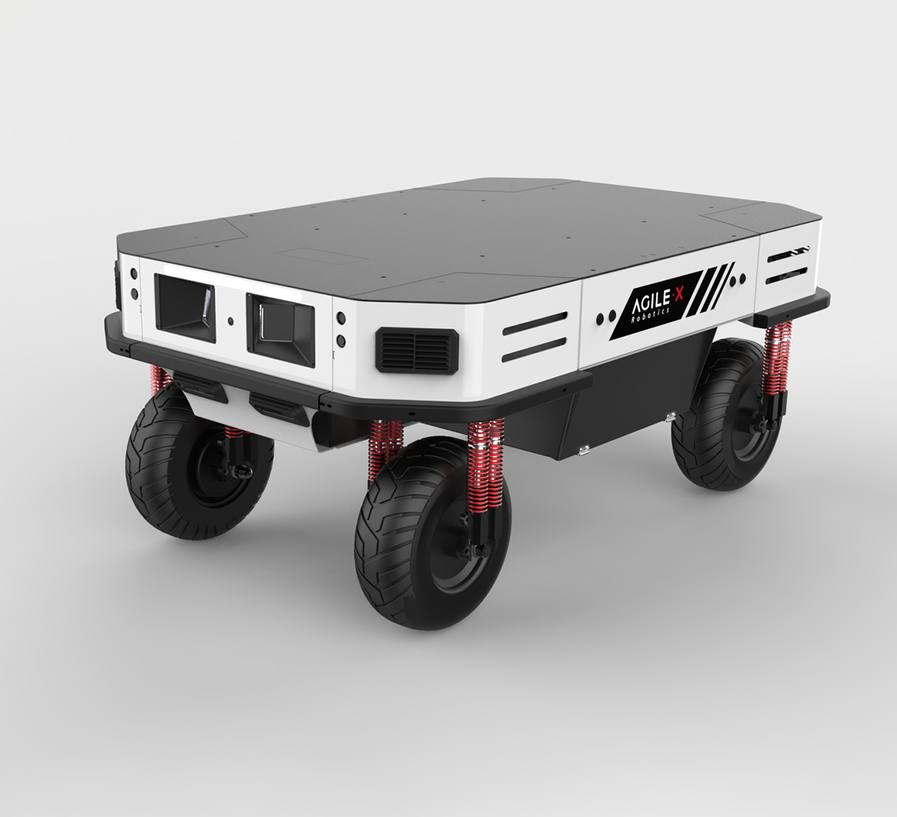
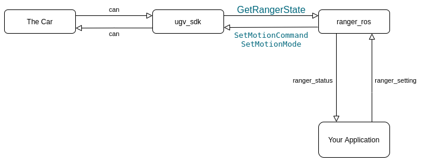

# ranger_ros

## ranger

* ranger mini  is the name of the following car

  

## Communicate Flow



* The `ugv_sdk` communicate with the car by `can protocol`
* The `ranger_ros` package call the function `GetRangerState` to get the newest machine information, call the `SetMotionCommand` to set linear velocity 、angle、etc, call the `SetMotionMode` to change the motion mode
* Ranger mini have 4 type of motion mode. see ranger mini manual from    [agilex develop manuals](https://github.com/westonrobot/ugv_sdk/tree/master/docs) 
* pub `ranger_ros` can set motion mode
* subscribe `ranger_status` can get the robot status

## Params

see `ranger_base/launch/ranger_mini_base.launch`

* is_ranger_mini :   ranger mini or ranger pro
* port_name:   can port name , usually is can0
* simulated_robot:   sim robot for test or not
* odom_frame:   the odometry frame name in tf
* base_frame:   the base link frame name in tf
* odom_topic_name:   the odometry topic name
* **pub_odom_tf:  publish tf transformation of odometry frame or not.  if true publish** 

## Build

dependencies:

* ROS1 melodic or newer

assume your ros workspace is ~/agilex_ws

```shell
cd ~/agilex_ws/src
git clone https://github.com/westonrobot/ugv_sdk.git
git clone https://github.com/westonrobot/ranger_ros.git

cd ..
catkin_make 

# for install
catkin_make install
```

## Run

```shell
# run ranger_ros
cd ~/agilex_ws
source devel/setup.bash
roslaunch ranger_bringup ranger_minimal.launch

```

use keyboard to control
> the default motion mode is Head-Back  Ackermann
```shell
# if you want to remote control the car by keyboard
sudo apt install ros-$ROS_DISTRO-teleop-twist-keyboard
roslaunch ranger_bringup ranger_teleop_keyboard.launch
```

## Examples

### 0. enable can control

```shell
robot->Connect("can0");
robot->EnableCommandedMode();
```


### 1. set motion mode

see `ranger_ros/ranger_examples/src/change_the_mode.cpp` for more details

```c++
robot->Connect("can0");
robot->EnableCommandedMode();

// 0 Arckmann 1 Slide 2 round, 3 Sloping
// 0 前后阿克曼 1 横移  2 自旋  3 侧移 
robot->SetMotionMode(0);
//  robot->SetMotionMode(1);
//  robot->SetMotionMode(2);
//  robot->SetMotionMode(3);
```


### 2. set the movement linear velocity and angle of the car

see `ranger_ros/ranger_examples/src/control_the_car.cpp` for more details

```c++
robot->SetMotionCommand(0.1, 30.0/180.0 * M_PI); // steer angle = 30°

// or write them in a function
void Ackermann() {
  robot->SetMotionMode(0);
  // or
  robot->SetMotionMode(RangerSetting::MOTION_MODE_ACKERMAN);
  l_v = 0.1;                  // m/s
  angle_z = 30 / 180 * M_PI;  // rad
}
void Slide() {
  robot->SetMotionMode(1);
  // or
  robot->SetMotionMode(RangerSetting::MOTION_MODE_SLIDE);
  l_v = 0.1;                  // m/s
  angle_z = 30 / 180 * M_PI;  // rad
}
void Round() {
  robot->SetMotionMode(2);
  // or
  robot->SetMotionMode(RangerSetting::MOTION_MODE_ROUND);
  l_v = 0.1;
  // angle_z is not used
}
void Sloping() {
  robot->SetMotionMode(3);
  // or
  robot->SetMotionMode(RangerSetting::MOTION_MODE_SLOPING);
  l_v = 0.1;
  // angle_z is not used
}
```

## use odometry

* subscribe `/odom` topic

